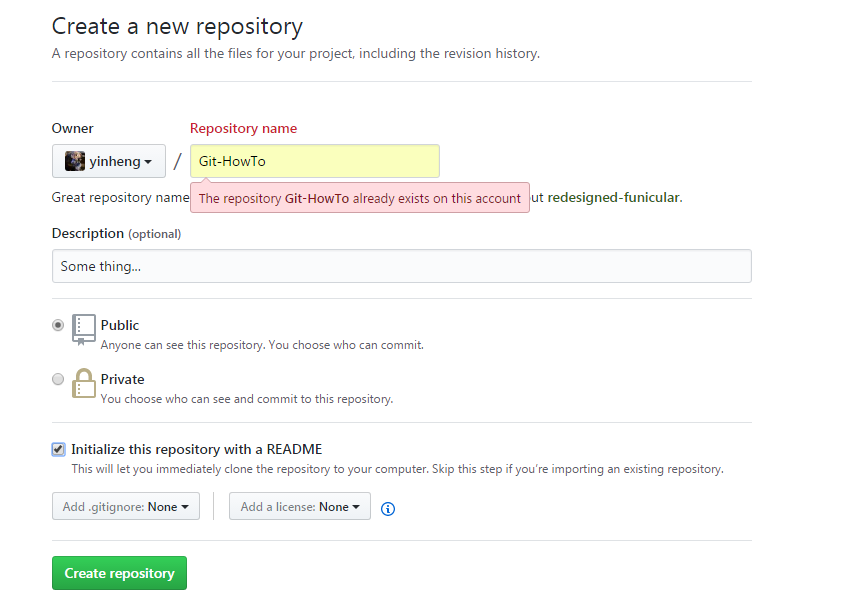
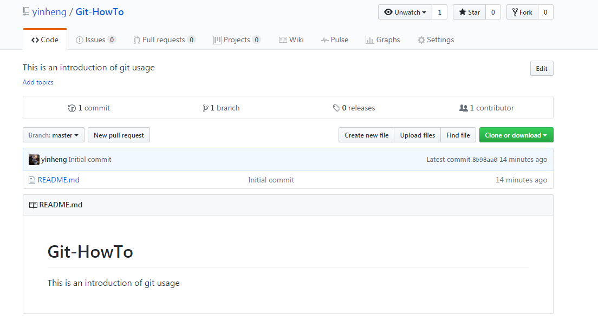
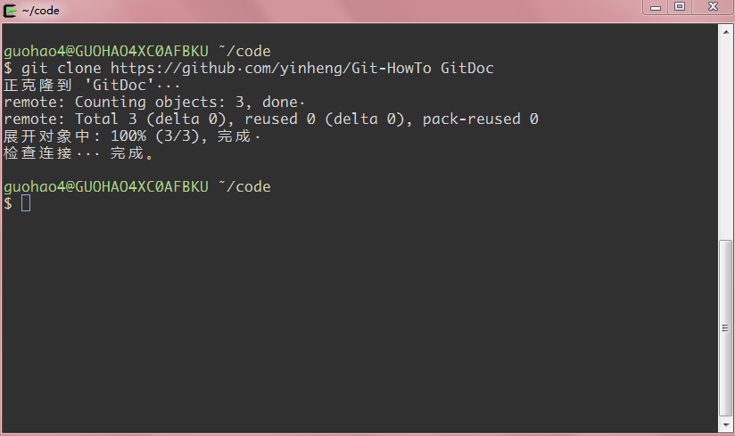
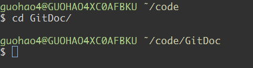
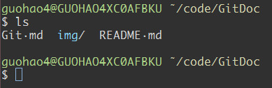
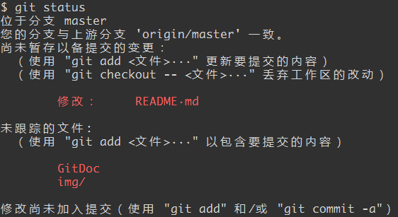
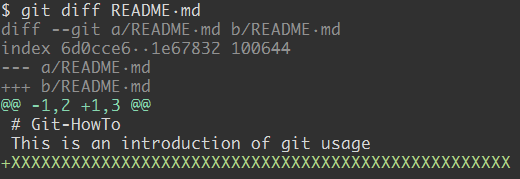
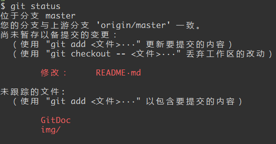
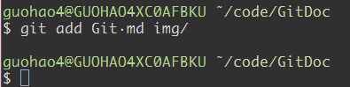
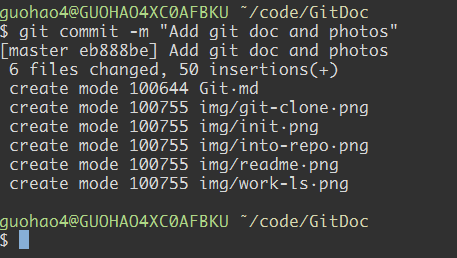

- ## 第一步，我们在github上创建一个仓库。


### 解释：

Repositiory name: 仓库名称，可任意。

README: 一般是指该仓库的说明文件，阅读该仓库内容之前需要先阅读的内容，类似于使用必读。其中该文件默认是.md类型，也就是markdown类型（Markdown 是一种轻量级标记语言）。当你进入github网站，打开该仓库时，github默认会显示README.md的内容。例如：本仓库（Git-HowTo）的README.md内容如下：
```
# Git-HowTo
This is an introduction of git usage
```
当我们进入项目主页时，看到的样子：



**.gitignore文件：** Github可以帮我们自动创建一个，这个文件里面主要列举我们要忽略哪些文件的改动，例如：如果我在.gitignored文件里面添加如下：
```
*.mp3
```
那么，我们本地所有对.MP3类型文件的操作（增删改）均会被无视。当我们执行```git status```命令时，不会出现该类文件的统计。

----------

- ## 第二步，Clone到本地。

我们使用了命令
```
git clone https://github.com/yinheng/Git-HowTo GitDoc
```
简化为
```
git clone 地址 文件夹
```
如果不指定文件夹，默认以仓库名新建文件夹。

----------

## 第三步，进仓库目录，查看或者修改文件，即开始工作。


例如：本次工作我在里面新建了一个文件：```Git.md```以及新建了一个文件夹```img```里面加了很多图片。
我们```ls```看下现在的目录：



当我们完成修改，准备提交之后，需要执行如下步骤：
1. ```git status```
这个命令是查看当前仓库状态，通常我们执行一次，看看我们具体改了哪些文件，防止由于不小心造成的误改。
例如，我执行了，结果如下：



其中，里面列举了哪些是修改的，哪些是新增的，当然也有删除的，只是这里我们没有删除任何文件。
我们注意到，README.md有改动，这个可能并不是我想要改的，可能是不小心误操作改动的，那么我们怎么去看我们对这个文件改了什么呢？

有一个笨的方法就是直接打开，看一下。

这里我们使用高级一点的方式：
```git diff README.md```



他会告诉你，你添加了一行```XXXXXXXXXXXXXXXXXXXXXXXXXXXXXX```内容。这个是我们无意加进去的，那么我们想让他 回到原来的样子，咋办，笨办法，手动修改，高级办法：

```git chekout README.md```

意思是检索该文件，事实上会让你这个文件恢复到原本样子（当然```git checkout```也可以加上```分支名```，切换到该分分支，以后再讲解）。

我们现在再看以下```git status```结果：



对吧，```README.md```没有出现在改动列表中。

OK，接下来我们需要添加这些改动的文件到改动区了，也就是第二步：

2. ```git add XXX```

其中XXX指的是哪些文件，多个文件用空格分开。也可以是文件夹。例如：我想把我添加的```Git.md```和```img```文件夹提交，我要执行：
```
git add Git.md img/
```
或者

```git add .```

把当前目录所有改动加进去。

如下图：



此命令执行完成不会有提示。

3. ```git commit -m "Commit message" ```

-m 后面要跟上你提交的信息，例如，本次我的提交信息是添加了git文档以及图片，那么我会执行：
```
git commit -m "Add git doc and photos"
```
结果如下：



会提示你你的commit都有什么改动。

4. ```git push origin master``` 输入用户名密码提交即可。
